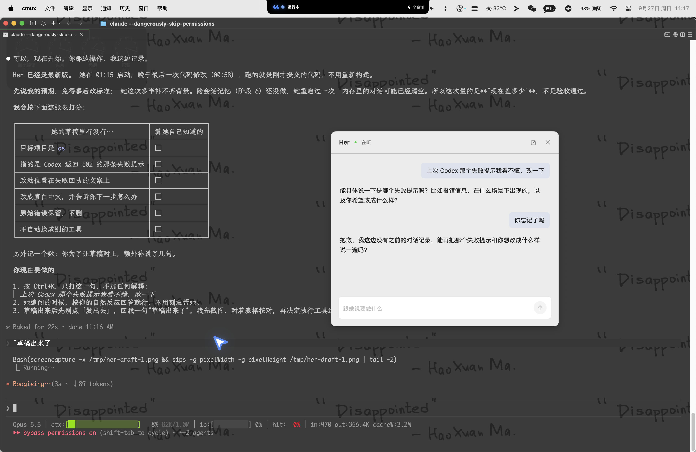

<!-- 走到哪了：由 ideas.py --refresh 生成，不要手改 -->
> [!NOTE]
> **走到哪了 · ● 在做**
> 记下委派并在对话中用上
> 下一步：用户在 Xcode 构建并重启 Her，用原句重测并核对草稿
> 上次更新：2026-09-27
<!-- /走到哪了 -->

## 等你决定
无

## 进度
- [ ] 第一块 记下每次委派（要求、草稿、项目、工具、结果含失败原文、合并或丢弃），重启后仍在；对话时把最近几条交给她

## 决定
| 日期 | 定了什么 | 为什么 |
|---|---|---|
| 2026-09-27 | 选 B：先补记录，再用同一句话重测 | 基线测试 0/6：她重启后完全不记得 Codex 502 那次，用户补说一句仍要求重述 |
| 2026-09-27 | 把 26 日两次 Codex 502 失败补记进记录 | 那次失败发生在记录功能之前，否则无法用同一句话重测 |
| 2026-09-27 | 记录是本机一个能打开看的文件，这一块不做查看/删除界面 | 控制在一块之内；阶段 6 的“看、改、删”以后做 |

## 为什么做
用户希望 Her 替他记挂着事情，不用反复解释自己。现在她每次重启都忘掉交出去过什么、结果如何，委派只是“转手”，不是伙伴。

## 怎样算做对了
用户说“上次那个……”时，她直接拿出那件事的项目、工具、结果和原始报错写草稿，用户不用再贴报错或解释背景。

## 这次不做
- 通用记忆（偏好、生活事项）和“忘掉”指令
- 主动提醒或跟进
- 查看、编辑、删除记录的界面
- 根据记录自动切换项目或执行工具

## 最危险的假设
把记录放进对话后，模型会在用户说得很含糊时正确对上那一条，而不是追问或张冠李戴 · 怎么验证：重启 Her 后用原句真实重测，并看草稿内容

## 用户能看到的行为
- [x] 用户交出一件事并得到结果 → 重启 Her 后这件事和结果仍在她的记录里
- [x] 用户说“上次 X 那个……” → 她不追问背景，直接给出引用了那次项目、工具和原始报错的草稿
- [x] 用户合并或丢弃改动 → 记录里这件事的结局随之更新
- [x] 执行中 Her 被关掉 → 记录显示这件事没有收到结果，而不是成功

## 证据
### 第一块 记下委派并在对话中用上

## 遗留
- 失败提示本身是原始英文报错（`没做成：Codex 退出码 1：unexpected status 502…`），用户看不懂——这正是重测时要交给她的任务
- Codex 本机路由 502 根因未查（见 docs/ROADMAP.md）
