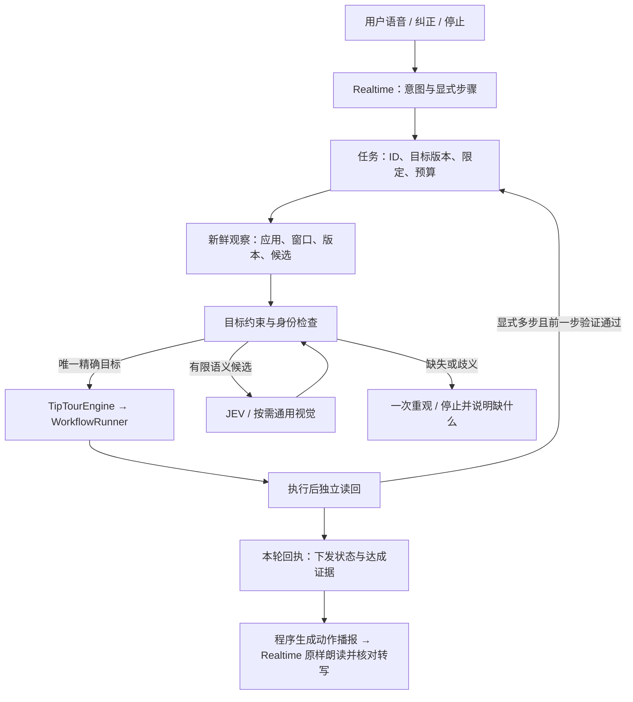

# 可信桌面语音控制：技术方案与验收契约

日期：2026-09-21。执行者：当前 ChatGPT 主代理，直接通过 DevSpace 修改本地 checkout。
基线：`main@6dbba3a`，包含接手时已有的未提交 StepFun/desktop companion 改动。
不提交、合并、发布，不重置已有改动，不运行终端 xcodebuild，不操作真实应用做点击实验。

## 问题与目标

用户提供的 PID 44419、00:33:48–00:34:56 日志摘要指出：纠正后零新动作却播报已点击；
视觉描述含 os 而候选不含；单目标要求连续点击多个无关控件；没有可靠用户转写追踪。
这不是 Safari 受控页验收。当前代码确认存在旧动作合并、精确标签失配后全池选取、
默认六动作、模型完成判断代替实际结果，以及工具前生成文字直接进入 TTS 的路径。
本文件不把未取得的原始日志补写成亲自重放证据。

目标：保持全双工对话，允许已授权短任务自动执行；纠正能接住，目标不能偷换，
执行不能越界，报告只能来自本轮真实结果。不要用不断向用户确认来代替内部定位。

## 架构选择

继续采用现有原生 Swift/AppKit 执行层，不引入第二个运行时或整包移植 jev-use。
借鉴其结构化候选与 observe → choose → act → verify 循环，不采用其耗时作为本项目指标。
StepFun Realtime 负责对话和结构化意图；现有通用/视觉客户端负责难以确定的指代；
JEV 只在满足任务限定的真实候选中选择，不能生成文本、目标或补造参数。
唯一精确目标由程序直接执行。沿用现有 provider，不新增规划模型服务。

### 任务及纠正

区分新任务、同目标续接、纠正；纠正撤销尚未下发的旧动作，产生新目标版本。
保留旧事实，但不将错误点击视为新目标的完成步骤，也不声称撤销已发生的动作。
旧 `resume_previous` 参数只作兼容输入：目标变化按纠正处理；不能复用旧动作冒充本轮。
任务回执区分 prior/current actions，附 task/turn/observation 身份、动作下发与验证状态。
取消和异常后保留可能已经送达的动作；不因为新一轮开始就自动重复不确定操作。

### 单目标与多步

默认单目标只有一次副作用预算；点击、双击、右击各算一个动作原语。
多步必须提供显式有界步骤（最多六步），每步有目标和动作参数；不能让“没有完成”
成为换一个无关目标再点的理由。程序限制预算，不依赖模型自觉。
打开应用、输入、按键、滚动复用已有 WorkflowRunner，不经 JEV 假装寻找屏幕上的应用图标。
输入必须带确定文本，快捷键必须带确定键值；缺失参数不猜测。
后果较大的发送/删除等保留原有授权边界，不通过新增路径旁路。

### 观察与目标

复用现有感知，不建新数据库。观察带 app/window、捕获时间、版本、完整有界候选集。
描述和动作引用同一份候选；编号必须同时引用观察 ID，失效则重新观察。
移除描述侧任意前 30 项截断；视觉自由描述不自动构成可点击目标。
明确标签不存在：最多重新观察一次，然后停止，绝不退回全池挑其他控件。
同名异位目标保留区别；可用明确位置/相对锚点缩小范围，仍不唯一才澄清。
原生 AX、OCR 和视觉是互补证据，不沿用已撤回的“视觉模型不能定位”判断。

### 验证与语音

区分请求已接受、输入可能送达、已送达、目标状态已验证。界面变化或模型 done 不能
独自证明目标完成。打开应用检查目标前台进程；输入检查目标字段值；点击检查目标
选中/焦点或显式预期结果。无法得到语义证据时报告未确认，不能伪造成功。
操作结果由代码根据当前回执生成中文播报。同一 Realtime 会话以单次指令
原样朗读该文本；音频先缓冲，只有返回转写与回执匹配才播放，否则仅显示真实回执。
普通对话的 `response.audio.delta` 到达后直接播放，不再二次调用独立 TTS。模型在工具前
可能说简短过渡语；提示词禁止提前声称完成，但这一点仍须真人语音验收。
屏幕问答与普通聊天保留；取消同时清理 Realtime 音频、待核对回执、待执行动作及迟到结果。

### 可观测性和隐私

用可筛选的结构化事件串联用户轮次、工具、观察、候选、选择、下发、验证与实际播报。
默认仅记录状态、计数和身份，不记录密钥、截图、文档正文或输入内容。
需要原始转写/工具参数的诊断必须显式开启本地 DEBUG 记录，限量保留，不上传。
当前实现最多两个约 2 MiB 文件，尚未实现按时间自动删除；测试后由操作者清理。
缺少转写时明确标记 unavailable，不将模型理解的 goal 写成用户原话。

## 可证伪验收

1. 上轮点过 A，本轮纠正 B 且 B 缺失：本轮零动作，播报不得称本轮点过 A/B。
2. 指定 os 而候选只有其他会话：含重观最多两次观察，零点击；JEV 高分不能绕过。
3. 一个单目标请求，即便决策器不断建议不同对象，也最多下发一次。
4. 模型返回 done 或界面变化但无目标达成证据：不得返回 completed。
5. 旧观察编号、换窗口、慢模型期间用户纠正、执行异常/取消：不得产生迟到旧动作。
6. 动作回执的 Realtime 转写与程序文本不匹配：音频不播放，面板仍显示本轮真实状态。
7. 显式多步只有前一步通过结果检查才继续；预算不得通过重复 tool call 重置。
8. 打开应用/输入/滚动等走既有共享引擎；参数不全、权限未开、上下文变化时不执行。
9. 现有 JEV、StepFun 解码、Realtime 音频、语音生命周期与感知回归继续通过。

先添加可重复的失败回归，再修实现并运行隔离 Swift 测试。真实 macOS 端到端/真人语音
分别标记；不把 mock、解析通过或单元测试数量写成真实体验已通过。默认入口迁移、
复杂跨应用长任务及长期技能自动学习不在未验收基础上启用；保留后续扩展接口即可。

## 执行记录

### 已落地的实现

保留原 provider 与共享执行引擎。新增类型化动作/回执、目标限定、单次或显式步骤预算、
独立结果验证、响应身份与播报门控、带观察身份的同帧图像/候选、受限本地诊断。
没有安装第二套运行时、引入新模型、切换默认入口或接入长期技能/记忆服务。
技术细节分别位于 `DesktopTaskContract`、`DesktopTaskCoordinator`、`DesktopTaskExecutor`、
`DesktopActionVerifier`、`StepFunResponseBoundary`、`DesktopVoiceTrace` 与既有路由/会话文件。

续接收尾补了两个真实回归：

- 已验证动作在回执返回前被打断：以前进度尚未递增，resume 会再做一次。现在先记事实进度，
  再检查取消，取消只阻止后续动作。新增测试先失败，再修复通过。
- 无效新请求留下旧步骤列表：以前新回执的目标可能被错误绑定到旧计划。现在先清除旧绑定；
  没有同目标有效计划的显式 resume 不执行。新增测试先失败，再修复通过。

`--voice-task-probe` 已改为调用完整生产 `StepFunRealtimeSession`。它使用合成 PCM 输入并捕获
Realtime 输出，不再维护“最多三个追加工具调用”的旧独立循环或独立 TTS。
探针分别保存工具回执、面板文字与 Realtime PCM。

### 受控桌面测试暴露并修正的感知问题

第一次真实复测发现：Safari 中的唯一按钮被判为多个目标。并非直接放宽同名限制：
实读候选显示，Safari 控件位于屏幕右侧 x≈1252，而同名 OCR 位于 x≈44，来自其他窗口。
已有整屏截图被当成单一应用候选空间。现按目标前台窗口过滤视觉候选，并将窗口身份、
进程和边界加入捕获失效判断。AX 菜单栏等本来就绑定目标应用的证据仍可保留。

第二个失败发生在“打开显示设置 → 缩放选项”：YOLO 把上方按钮的检测框误配成下方文字。
对应 AX 已给出了同一位置的正确标签。现要求 OCR 文字与检测框实际重叠，禁止以距离
替代重叠；高度重合的 YOLO/AX 冲突以原生标签为准，不合并不同位置的真实同名目标。
这两类修复都有从现场坐标构造的回归，且未改动受控页以迎合验证器。

### 验收证据的边界

上一次中断前四组隔离测试共 102 项通过，最后的全应用类型检查正常退出 0；中断发生在
读取结果时。续接不重跑未受影响的测试。新行为修改后只运行受影响的任务/语音边界和感知组。
实际应用通过 Xcode 的原生 Build action 构建并使用原有签名，没有从终端运行 xcodebuild。

应用运行探针和测试页 `/state` 是两份独立证据。错误参数、缺失精确目标、歧义目标应零动作；
“点击已发生但缺少目标证明”应如实暂停，而不是为了让报告全绿改成成功。
显式结果标签测试证明的是调用者声明的后置条件，不代表任意 GUI 按钮都能自动验证。

Safari AppleScript 创建文档曾超时；随后用 LaunchServices 打开测试 URI，并通过应用自身
感知确认了 Safari、验收页标题、两个测试任务按钮和显示设置按钮，才开始发送受控点击。
未经确认的界面没有收到测试点击。详细结果及后续限制见本节下方最终记录。

### 仍有明确边界

普通对话已恢复 Realtime PCM 流式播放；动作回执为了核对内容，仍要等本轮转写完整后再播。
单次启动探针的耗时包含应用启动、观察与执行，
不是 JEV 决策耗时，也不是真人语音端到端延迟。

键盘/滚动等没有通用可判定后置条件时仍保守暂停；复杂跨应用长任务、完整 DOM/视觉统一图、
长期技能自动学习不在本轮交付范围。真人拾音、回声消除、听感与语音打断仍须单独验收。

GitHub 仓库已禁用 Issues，未擅自更改仓库设置；任务与验收契约保留在本文件。

## 最终记录（本次续接）

### 工程检查

- 原有未受影响的检查沿用中断前结果；新增 6 个回归：两个续接边界、两个窗口范围、两个标签归属。
- 续接/任务契约/语音边界相关 39 项通过；额外单独运行的 6 项语音边界属于这 39 项，不重复计数。
- 感知组最终 12 项通过，包含实际中文 OCR 与目标缓存回归。
- 结合未变部分，现有隔离测试证据共覆盖 108 个不同测试；这不是一次真人端到端成功率统计。
- 最后一次 Xcode Build action：`87153-7`，`succeeded`。此前失败的是读取构建错误列表的脚本表达式，
  并非构建失败；已读取对应 action 的实际成功状态，没有因此重复起同一次构建。
- `git diff --check` 通过。HEAD 仍为 `6dbba3a`，未提交、推送或合并，继承改动保留。

### 已执行的真实桌面场景

以下是应用生产路由、协调器和执行器的真实桌面操作，并同时读取独立测试页 `/state`。
修复后只复测受影响路径；这些不是“同一构建整组重复三轮”的证据。

| 场景 | 应用回执 | 独立读回 / 结论 |
| --- | --- | --- |
| 未知参数 `target_labe` | `failed`，零动作 | 测试页未变化；正确拒绝 |
| 精确指定不存在的控件 | `needs_clarification`，零动作 | 未用其他控件替代 |
| 未区分左右两个“设置” | `needs_clarification`，零动作 | 没有任意选第一个 |
| 单次点击，不提供可读回的结果条件 | `paused`，一次下发、未确认 | `/state` 为 `task-3`、一次点击；没有把页面变化说成目标已验证 |
| 同一点击，提供明确结果条件 | `completed`，一次已验证动作 | `/state` 为 `task-3`、一次点击，与回执一致 |
| 打开显示设置，再选缩放 | `completed`，两次已验证动作 | `events=[open-menu, scale]`、`selected=scale`，顺序正确 |

测试页的 `clicks` 只计 `/select`，不计 `/menu`，所以两步流程的 `clicks=1`；
实际两次动作由 `events` 和两个 `current_actions` 共同确认。
成功路径使用精确目标直达，没有声称这些场景验证了真实 JEV 的语义判断能力。

本机临时证据目录：
`/var/folders/k6/7c96rbxd1r782myg_bnlqshw0000gn/T/tiptour-resume-runtime-rl2jhryv`。
`controlled-results.json` 保留最初失败；`window-scoped/controlled-results.json` 保留窗口修复后的
三项通过和两步失败；`final/two-steps-check.json` 保存最后两步成功的回执及独立状态。
不覆盖失败记录来伪造一次全通过。临时目录不是永久归档，关键结论保留于本文。

### 未完成的语音验收

用系统合成的公开中文语句“请点击名为验收控件零九二一的按钮。只点击这个名字的按钮。”
制作了 24 kHz 单声道 PCM16 输入，并启动生产会话探针。
探针在 `StepFun Keychain key unavailable` 处停止：无交互模式未能取得现存 StepFun 密钥，
尚未进入 Realtime 模型调用，未生成 `realtime.json`。
对应日志为 `final/voice-missing-control.log`。不能将语音门控单元测试或桌面点击成功当作
这次真实语音链路已通过；也不能据此判断是模型能力或速度的问题。
没有导出密钥、改读环境密钥或改动 Keychain 授权来绕过阻塞。

### 运行与清理

测试进程自行退出，随后以普通模式重新启动最终应用，不打开麦克风、不迁移默认入口。
复用了此前已运行的测试服务，没有终止它。仅针对 `/?case=` 临时标签页的清理请求再次
遇到 Safari AppleEvent 超时，无法确认清理完成；未使用盲目的快捷键关闭用户页面。

### Realtime 直出修正

语音回复不再交给 `stepaudio-2.5-tts` 二次合成。普通回复收到
`response.audio.delta` 后立即进入现有播放器；项目中已删除独立 TTS 输出类、对应测试和
探针入口。动作回执仍由程序状态生成，但改为要求同一个 Realtime 会话原样朗读：音频先缓存，
等最终转写与回执正文一致后才播放；若有增删或改写则丢弃音频，并在面板保留程序回执。

本次修正后，语音生命周期整组 67 项、StepFun 决策组 11 项、全应用类型检查均通过；
`git diff --check` 通过，生产源码、测试、脚本与工具中不再引用独立 TTS 类或
`stepaudio-2.5-tts`。Xcode 原生 Build 于 14:42 成功，签名复核通过，新构建以 PID 14371
运行。无交互播放探针仍因 Keychain 拒绝读取而未进入网络调用；因此 Realtime 真人听感、
拾音、打断和动作回执原样朗读仍需在这个进程上完成一次真实语音验收。
